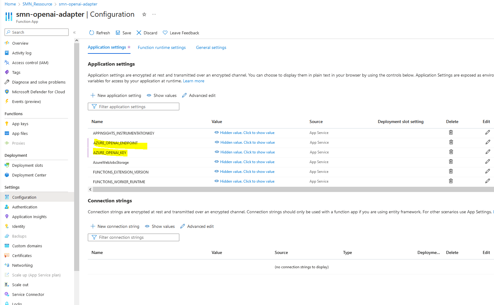

# azurefunction-demo

# connect to open ai wit an azure function

- set enviroment varanles for azure open ai connection:




- publish to azure via ```func azure functionapp publish smn-openai-adapter```